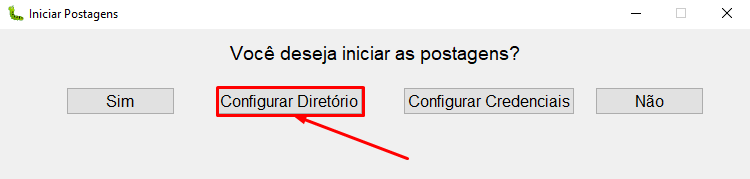
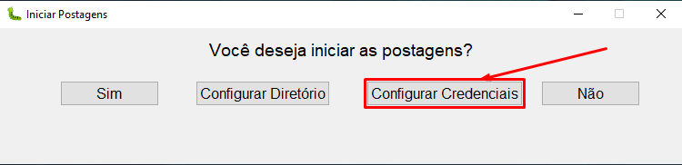

<!DOCTYPE html>
<html>
<head>
    <meta charset="utf-8">
</head>
<body>

<h1 align="center">Automatização de Publicações no Facebook Business Manager</h1>

    
    

Este é um projeto Python que automatiza a publicação de postagens no Facebook Business Manager, simplificando tarefas de marketing e permitindo configurar facilmente o diretório de imagens e as credenciais de login.

<h2>Dependências</h2>

<ul>
    <li><a href="https://pyautogui.readthedocs.io/en/latest/">PyAutoGUI</a>: Para a automação de tarefas no sistema.</li>
    <li><a href="https://docs.python.org/3/library/tkinter.html">Tkinter</a>: Para a criação da interface gráfica.</li>
    <li><a href="https://docs.python.org/3/library/pickle.html">Pickle</a>: Para a persistência de credenciais.</li>
</ul>

<h2>Funcionalidades</h2>

<ul>
    <li><strong>Configuração de Diretório de Imagens:</strong> Permite selecionar o diretório de imagens a serem publicadas nas postagens.</li>
    <li><strong>Configuração de Credenciais:</strong> Permite configurar e salvar as credenciais de e-mail e senha para o login automático no Facebook Business Manager.</li>
    <li><strong>Login Automático:</strong> Realiza o login no Facebook Business Manager com as credenciais configuradas.</li>
    <li><strong>Publicação de Conteúdo:</strong> Automatiza a criação de postagens e facilita o processo de compartilhamento de mídia.</li>
</ul>

<h2>Uso</h2>

<ol>
    <li>Execute o script Python.</li>
    <li>Use a interface para configurar o diretório de imagens e as credenciais de login.</li>
    <li>Clique em "Sim" para iniciar a automação das postagens.</li>
</ol>

<h2>Configuração</h2>

<h3>Diretório de Imagens</h3>

    

Clique em "Configurar Diretório" para escolher o diretório que contém as imagens a serem publicadas.

<h3>Credenciais de Login</h3>

    

Clique em "Configurar Credenciais" para inserir e salvar as credenciais de e-mail e senha.

<h2>Personalização</h2>

Você pode personalizar a interface gráfica e a automação de tarefas conforme suas necessidades.

<h2>Licença</h2>

Este projeto está sob a <a href="LICENSE">Licença MIT</a>.

<footer>
    
Ícones feitos por <a href="https://www.iconfinder.com/">Iconfinder</a> e <a href="https://www.freepik.com/">Freepik</a> do <a href="https://www.flaticon.com/">Flaticon</a>.

</footer>

</body>
</html>
